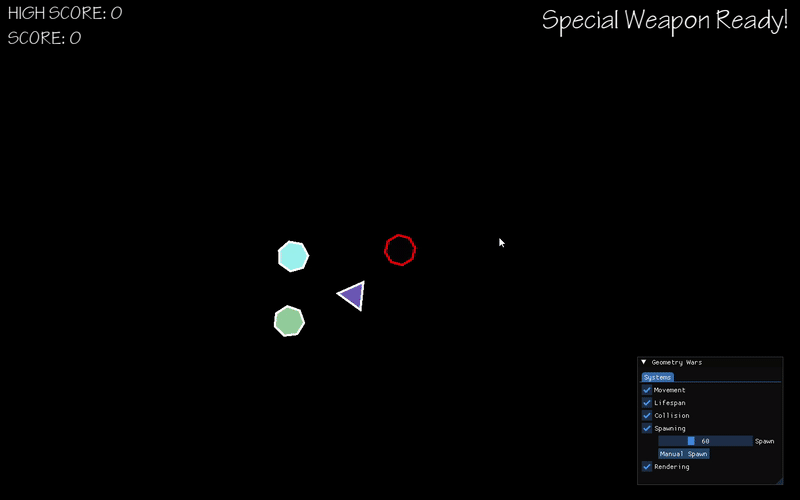

# Geometry Wars

[English]  
Simple Geometry Wars in C++, SFML.

[한국어]  
C++, SFML으로 만든 간단한 Geometry Wars.

## Preview



## Controls

[English]
- WASD: Move player
- Left Mouse Button: Shoot
- Right Mouse Button: Special weapon
- P: Pause game
- ESC: Quit game

[한국어]
- WASD: 플레이어 이동
- 마우스 왼쪽 버튼: 발사
- 마우스 오른쪽 버튼: 특수 무기
- P: 게임 일시 정지
- ESC: 게임 종료

## Requirements

[English]
- CMake 3.13 or higher
- C++17 compatible compiler

[한국어]
- CMake 3.13 이상
- C++17 지원 컴파일러

## Build Instructions

[English]
```bash
# Clone the repository
git clone https://github.com/gooriball/Simple-Geometry-Wars.git
cd Simple-Geometry-Wars

# Build && Run
cmake -S . -B build -DCMAKE_BUILD_TYPE=Release

cmake --build build --config Release --parallel

cmake --build build --config Release --target run
```

[한국어]
```bash
# 저장소 복제
git clone https://github.com/gooriball/Simple-Geometry-Wars.git
cd Simple-Geometry-Wars

# 빌드 && 실행
cmake -S . -B build -DCMAKE_BUILD_TYPE=Release

cmake --build build --config Release --parallel

cmake --build build --config Release --target run
```

## Tech Stack

### Language
- C++

### Libraries
- [SFML](https://github.com/SFML/SFML)
- [ImGui](https://github.com/ocornut/imgui)
- [ImGui-SFML](https://github.com/SFML/imgui-sfml) 
- [spdlog](https://github.com/gabime/spdlog)
- [nlohmann/json](https://github.com/nlohmann/json)

### Build Tools
- CMake

## License

[English]  
This project is licensed under the MIT License - see the [LICENSE](LICENSE.md) file for details.

[한국어]  
이 프로젝트는 MIT 라이선스 하에 배포됩니다 - 자세한 내용은 [LICENSE](LICENSE.md) 파일을 참조하세요.
